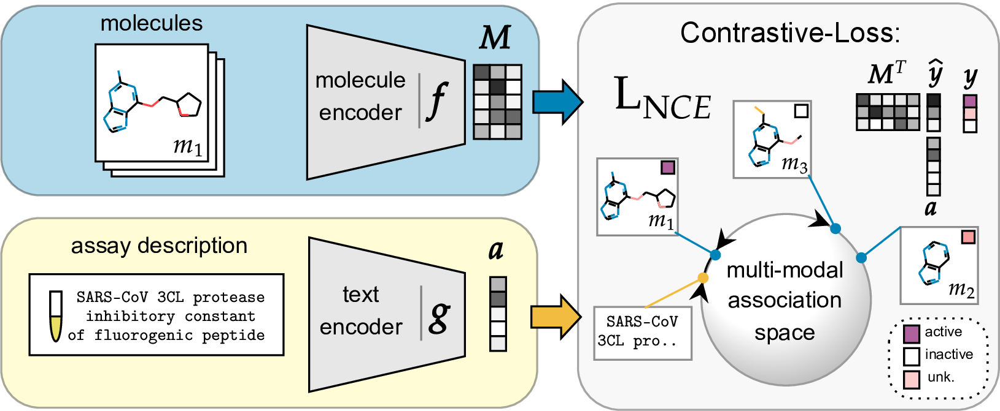

# :clamp: CLAMP

[](https://arxiv.org/abs/2303.03363)
[](https://www.gnu.org/licenses/gpl-3.0)
[](https://colab.research.google.com/github/ml-jku/clamp/blob/main/notebooks/CLAMP_colab_demo.ipynb)

CLAMP (Contrastive Language-Assay Molecule Pre-Training) is trained on molecule-bioassay pairs. It can be instructed in natural language to predict the most relevant molecule, given a textual description of a bioassay, without training samples. In extensive experiments, our method yields improved predictive performance on few-shot learning benchmarks and zero-shot problems in drug discovery. 

## Approach



## :rocket: Updates

- 04/24: create augmentations for assay-descriptions using [assay_augment.py](./clamp/dataset/assay_augment.py) 
- 11/23: Pretrained Model weights for Frequent Hitter (FH), a strong baseline for few- and zero-shot drug discovery. Use it running `fh_model = clamp.FH(device='cpu')`.
- 10/23: PubChem23, a new version of the PubChem-dataset with >~500k assays, in a preprocessed form is available (see [./data/pubchem.md](./data/pubchem.md))

## :gear: Setup Environment

When using `conda`, an environment can be set up using
```bash
conda env create -f env.yml
conda activate clamp_env
```
To activate the environment call ```conda activate clamp_env```.
You may need to adjust the CUDA version.

Another option is:
```bash
pip install -e git+https://github.com/ml-jku/clamp.git
```

## :fire: Use a pretrained CLAMP model

Warning: Currently only one version is available. We will update this repo with new pretrained models.

```python
import torch
import clamp

model = clamp.CLAMP(device='cpu')
model.eval()

molecules = [
    'CCOP(=O)(Nc1cccc(Cl)c1)OCC', #inactive
    'O=C(O)c1ccccc1O', #inactive
    'NNP(=S)(NN)c1ccccc1', #active
    'CC(=O)OC1=CC=CC=C1C(=O)O', # Aspirin
    ]
assay_descriptions = [
    'HIV: Experimentally measured abilities to inhibit HIV replication.',
    ]

with torch.no_grad():
    logits = model.forward_dense(molecules, assay_descriptions)
    probs = logits.softmax(dim=0).cpu().numpy() # probs for molecules

print("Mol probs for assay:", probs[:,0]) # res: [0.258 0.235 0.269  0.236]
```


## :lab_coat: Reproduce

### Setup FS-Mol
For the [preprocessed FS-Mol dataset](https://cloud.ml.jku.at/s/dCjrt9c4arbz6rF/download) used in the paper run the following commands, which downloads, unzips and deletes the zip-file from your clamp directory:
```bash
wget -N -r https://cloud.ml.jku.at/s/dCjrt9c4arbz6rF/download -O fsmol.zip
unzip fsmol.zip; rm fsmol.zip
```

To download an preprocess from the original source:
```python clamp/dataset/prep_fsmol.py --data_dir=./data/fsmol/```

To compute the compound encodings as input for your model run
```bash
python clamp/dataset/encode_compound.py \
--compounds=./data/fsmol/compound_names.parquet \
--compound2smiles=./data/fsmol/compound_smiles.parquet \
--fp_type=morganc+rdkc --fp_size=8096
```

To compute the assay encodings as input for your model run
```bash
python clamp/dataset/encode_assay.py --assay_path=./data/fsmol/assay_names.parquet --encoding=clip --gpu=0 --columns \
assay_type_description description assay_category assay_cell_type assay_chembl_id assay_classifications assay_organism assay_parameters assay_strain assay_subcellular_fraction assay_tax_id assay_test_type assay_tissue assay_type bao_format bao_label cell_chembl_id confidence_description confidence_score document_chembl_id relationship_description relationship_type src_assay_id src_id target_chembl_id tissue_chembl_id variant_sequence \
--suffix=all
```
or use ```--encoding=lsa```.

### Setup PubChem

for the [version used in the paper](https://cloud.ml.jku.at/s/2ybfLRXWSYb4DZN/download) as well as to generate an up-to-date version see ```./data/pubchem.md```

## :fire: Train your own model

Run (adjust hparams by adding it as command or in the file ```./hparams/default.json```)
```bash
python clamp/train.py --dataset=./data/fsmol --assay_mode=clip --split=FSMOL_split
```

This should result in a model with a zero-shot $\text{AUROC}$ of $0.70$ and $\Delta \text{AP}$ of $0.19$ on the test-set.

## Evaluate a pretrained CLAMP model

Note alterations in the exact split, as well as in the pretraining (droped MoleculeNet molecules)

to compute the clip assay-features run:
```
python clamp/dataset/encode_assay.py --assay_path=./data/pubchem18/assay_names.parquet --encoding=clip --gpu=0 --columns title
```
and for the compound-features:
```
python clamp/dataset/encode_compound.py --compound2smiles=./data/pubchem18/compound_smiles.parquet --compounds=./data/pubchem18/compound_names.parquet --fp_type=morganc+rdkc --fp_size=8192
```

Now you can use the pretrained CLAMP model:
```bash
python clamp/train.py --model=PretrainedCLAMP --dataset=./data/pubchem18 --assay_mode=clip --split=time_a --epoch_max=0
```
(Warning about checkpoint can be ignored) 
This should return $\Delta \text{AP}$ of $0.13$ on the test-set.

## Downstream Evaluation:
### Setup MoleculeNet

To download the preprocessed downstream datasets call
```bash
wget -N -r https://cloud.ml.jku.at/s/pyJMm4yQeWFM2gG/download -O downstream.zip
unzip downstream.zip; rm downstream.zip
```

To download an preprocess the downstream datasets from the source call.
```python clamp/dataset/prep_moleculenet.py```
(Doesn't include Tox21-10k)

## :test_tube: Linear Probing
Get a clamp-encoding
```
python clamp/dataset/encode_compound.py --compound2smiles=./data/moleculenet/tox21/compound_smiles.parquet --fp_type=clamp
```
Run linear probing on this encoding
```
python clamp/linear_probe.py ./data/moleculenet/tox21/ --split=scaffold_split --compound_mode=clamp
```

You can also use the clamp-encoding of a pretrained model by providing an mlflow run-directory:
You have to specify the correct compound_features_size as well as the assay_features_size of the model.
```
python clamp/linear_probe.py ./data/moleculenet/hiv/ --split=scaffold_split --run_dir=./mlruns/711448512597702417/c00af103806c4243b816ecf2aed7387a/ --compound_features_size=8192 --assay_features_size=867
```

A further example can be found in the [colab-demo](https://colab.research.google.com/github/ml-jku/clamp/blob/main/notebooks/CLAMP_colab_demo.ipynb).


## :books: Cite
If you find this work helpful, please cite
```bibtex
@article{seidl2023clamp,
   author = {Seidl, Philipp and Vall, Andreu and Hochreiter, Sepp and Klambauer, G{\"u}nter},
   title = {Enhancing Activity Prediction Models in Drug Discovery with the Ability to Understand Human Language},
   journal = {Proceedings of the 40th International Conference on Machine Learning (ICML)},
   institution = {Institute for Machine Learning, Johannes Kepler University, Linz},
   year = {2023},
   month = {July},
   eprint={2303.03363},
   doi = {}
}
```

## Keywords
Drug Discovery, Machine Learning, Zero-shot, NLP, LLM, Scientific Language Model
